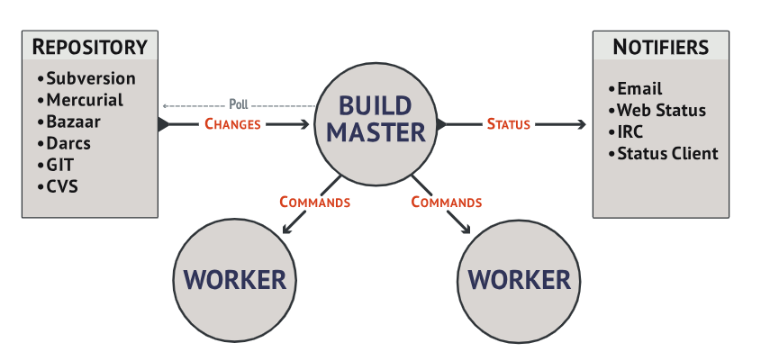
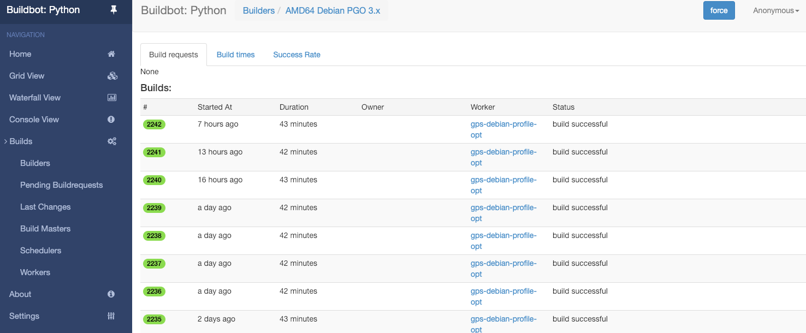
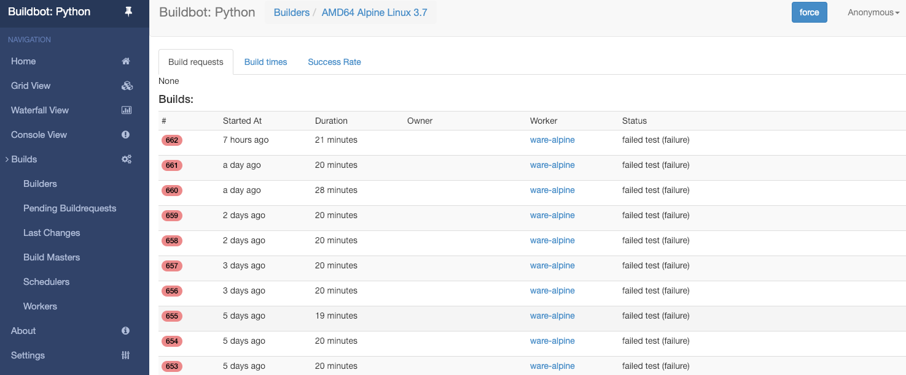
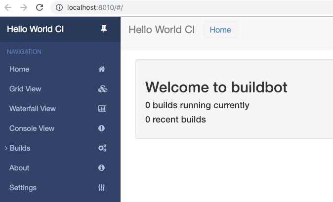
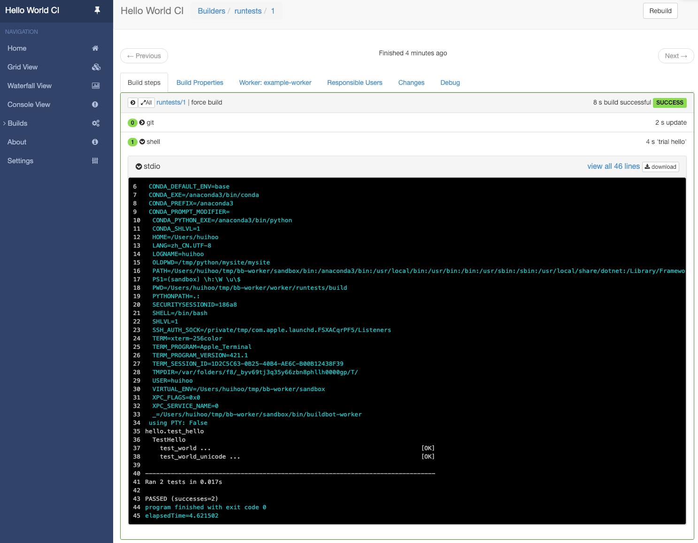

# 第22课：测试（Testing）（二）

### 持续集成

常用的CI服务器有：Jenkins、Travis CI、GitLab CI、Buildbot等。

这里，我们使用Buildbot做持续集成服务器。

Buildbot 是一个软件项目编译、测试的自动化系统，它的架构如下：

 主要包含：Master、Worker

### Python Buildbot
Python 也采用 Buildbot 作为自己的构建、测试和持续集成的基础设施，我们先[感受下](https://www.python.org/dev/buildbot/)。

 最近的构建

 构建成功

 构建失败

###  安装
以 [virtualenv](https://pypi.python.org/pypi/virtualenv) 的方式安装和运行 Buildbot，virtualenv大家也同时了解下。
```
（1）安装 master
$ mkdir -p ~/tmp/bb-master
$ cd ~/tmp/bb-master
$ python3 -m venv sandbox
$ source sandbox/bin/activate

$ pip install --upgrade pip
$ pip install 'buildbot[bundle]'

（2）创建并启动 master
$ buildbot create-master master
$ mv master/master.cfg.sample master/master.cfg
$ buildbot start master

（3）安装 worker
打开另一个终端
$ mkdir -p ~/tmp/bb-worker
$ cd ~/tmp/bb-worker
$ python3 -m venv sandbox
$ source sandbox/bin/activate

$ pip install --upgrade pip
$ pip install buildbot-worker
$ pip install setuptools-trial

（4）创建并启动 worker
$ buildbot-worker create-worker worker localhost example-worker pass
$ cat ../bb-master/master/master.cfg
$ buildbot-worker start worker
```
http://localhost:8010



### Hello World
使用这个测试用例 https://github.com/buildbot/hello-world

```
$ cd ~/tmp/bb-master
$ source sandbox/bin/activate
$ 看一看这个文件 master/master.cfg，应包含
c['title'] = "Hello World CI"
c['titleURL'] = "https://buildbot.github.io/hello-world/"

打开 Builders 页，点击 runtests 链接，点击右上角 “force” 按钮，然后 Start Build。
```


开心，构建成功 :)



配图来自Twitter：@neku_draw


