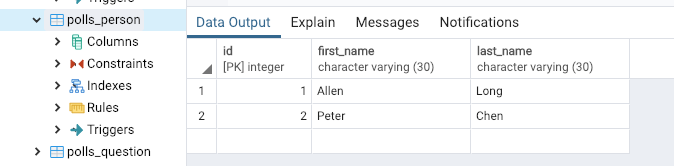

# 第33课：模型（一）

### 模型定义
一般来说，每一个模型都映射一个数据库表。
* 每个模型都是一个 Python 类，这些类继承 django.db.models.Model
* 模型类的每个属性都相当于一个数据库的字段
* Django 自动生成访问数据库的 API

### 创建模型
为了方便，我们直接使用之前创建的polls应用。

定义了一个 Person 模型, 包含 first_name 和 last_name，将以下内容加入 mysite/polls/models.py:
```
class Person(models.Model):
    first_name = models.CharField(max_length=30)
    last_name = models.CharField(max_length=30)
```
1、运行：$ python manage.py makemigrations polls
```
Migrations for 'polls':
  polls/migrations/0002_person.py
    - Create model Person
```
2、检查：$ python manage.py sqlmigrate polls 0002

3、迁移：$ python manage.py migrate 

这时，这个模型会自动在数据库中生成一张新表：
```
CREATE TABLE polls_person (
    "id" serial NOT NULL PRIMARY KEY,
    "first_name" varchar(30) NOT NULL,
    "last_name" varchar(30) NOT NULL
);
```

### 初始化数据
数据库表创建好后，可通过 python manage.py loaddata `<fixturename>` 的方式初始化数据库，数据文件格式可以是 JSON 或 YAML。

创建 polls-person.json 文件：
```
[
  {
    "model": "polls.person",
    "pk": 1,
    "fields": {
      "first_name": "Allen",
      "last_name": "Long"
    }
  },
  {
    "model": "polls.person",
    "pk": 2,
    "fields": {
      "first_name": "Peter",
      "last_name": "Chen"
    }
  }
]
```
运行 $ python manage.py loaddata polls-person.json 

Installed 2 object(s) from 1 fixture(s)

这时 polls_person 新建了两条记录，你可以通过这种方式初始化数据库，或把其它系统的数据导出再导入新系统。



### 使用模型
你可以通过以下的方式使用模型（数据库表），进行增删改查等操作。
```
>>> import psycopg2
>>> conn = psycopg2.connect("dbname=mysite user=postgres password=postgres")
>>> cur = conn.cursor()
>>> cur.execute("SELECT * FROM polls_person;")
>>> cur.fetchall()
[(1, 'Allen', 'Long'), (2, 'Peter', 'Chen')]
```

配图来自Twitter：@kagachi_SK


