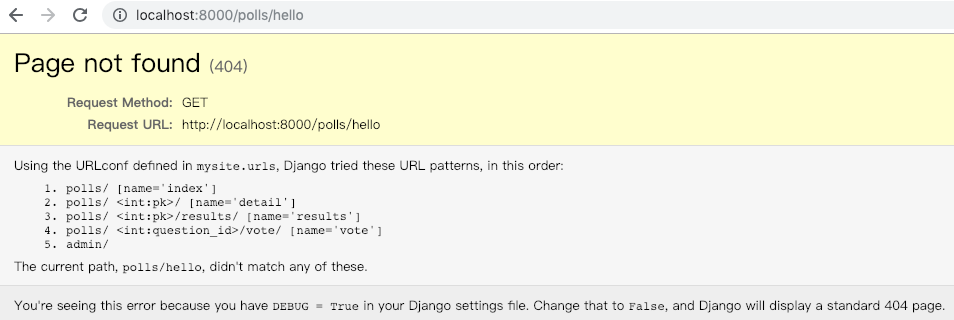

# 第35课：视图（一）
视图简单讲就是负责处理用户的请求并返回响应。

### 一个简单视图
```
from django.http import HttpResponse
import datetime

def current_datetime(request):
    now = datetime.datetime.now()
    html = "<html><body>It is now %s.</body></html>" % now
    return HttpResponse(html)
```

### 优雅URL
回顾一下我们之前在 [polls](python28.md) 应用的URL设计。

### 装饰器（decorators
Django 提供了多个可以应用于视图的装饰器，以支持各种HTTP功能，使用 @ 标识符。

```
from django.contrib.auth.decorators import login_required

@login_required(login_url='/accounts/login/')
def my_view(request):
    ...
```
每次用户试图访问 my_view 时，都会检查用户是否通过身份验证，并将未登录用户重定向到login_url。

### 快捷函数
包 django.shortcuts 收集了“跨越” 多层MVC 的辅助函数和类。 换句话讲，这些函数/类为了方便，引入了可控的耦合。 

* render()
* render_to_response()
* redirect()
* get_object_or_404()
* get_list_or_404()

我们常用 render() 替换 HttpResponse()
```
from django.shortcuts import render

def my_view(request):
    # View code here...
    return render(request, 'myapp/index.html', {
        'foo': 'bar',
    }, content_type='application/xhtml+xml')
```
相当于：
```
from django.http import HttpResponse
from django.template import loader

def my_view(request):
    # View code here...
    t = loader.get_template('myapp/index.html')
    c = {'foo': 'bar'}
    return HttpResponse(t.render(c, request), content_type='application/xhtml+xml')
```

### 内置视图
Django 提供了内置视图，如 error 视图：
* 404 (page not found) 
defaults.page_not_found(request, exception, template_name='404.html')
* 500 (server error) 
defaults.server_error(request, template_name='500.html')
* 403 (HTTP Forbidden) 
defaults.permission_denied(request, exception, template_name='403.html')
* 400 (bad request)
defaults.bad_request(request, exception, template_name='400.html')



配图来自Twitter：@chengr28


