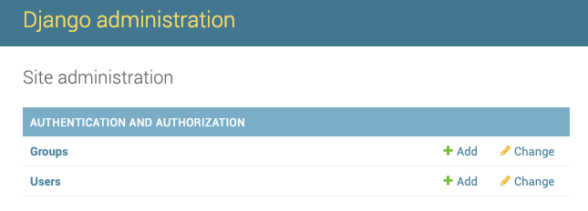
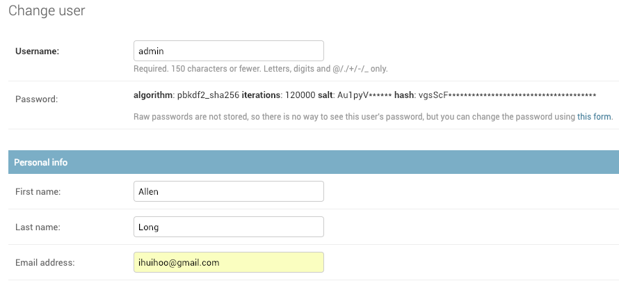
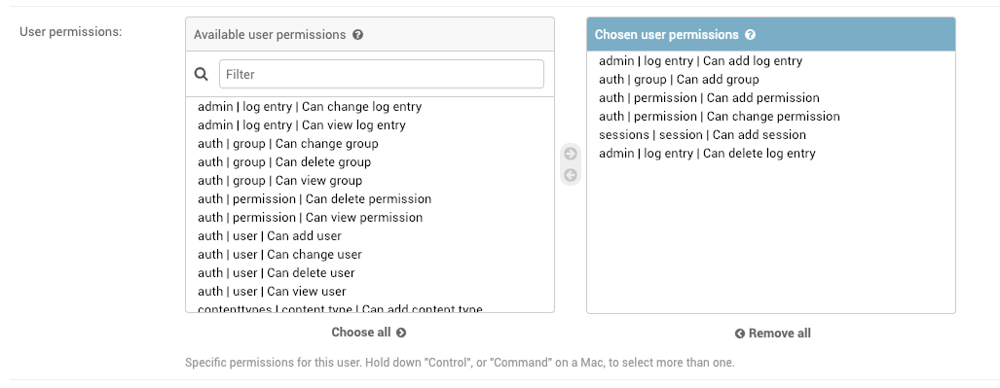

# 第41课：认证

### 认证中间件
AuthenticationMiddleware

### 用户认证
Django 带有用户身份验证系统，包含用户账号、用户组、权限和基于cookie的用户管理。

默认用户的主要属性有：
* username
* password
* email
* first_name
* last_name

### 第三方验证
支持微博、微信、Twitter、Facebook 等第三方身份验证和账户登录。

### 自定义扩展Django验证
Django 自带的验证机制足以应对一般情况，但用户总会有自己的特殊需求，这时就需要自定义和扩展验证机制，你需要了解在已有验证系统中哪些地方是可以扩展的，哪些地方是可以代替的。

配图来自Twitter：@chengr28

