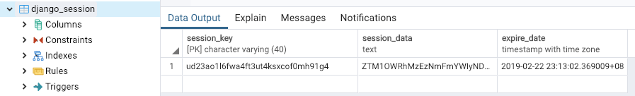

# 第42课：会话

### 了解会话
打开浏览器，我们使用 Cookie 包含会话ID，而不是数据本身（除非你使用基于cookie的后端），Django 会话框架基于 cookie，Django 有完整的会话管理解决方案，支持多种后段服务。
* django.contrib.sessions.backends.db （默认）
* django.contrib.sessions.backends.file
* django.contrib.sessions.backends.cache
* django.contrib.sessions.backends.cached_db
* django.contrib.sessions.backends.signed_cookies 

一旦用户通过身份验证，Django 会将之前用于验证该用户的后端保存在用户的 session 中，以便在将来（session 有效期内）需要访问当前已验证的用户时可以重用该后端。这个优化意味着在 session 中缓存了验证后端的代码，因此，如果你修改了 AUTHENTICATION_BACKENDS 同时希望使用另外的方法重新验证用户，那么需要清除 session 数据，清除 session 数据的一个简单方法是执行 Session.objects.all().delete()。


Django 会话是通过中间件实现的，在 mysite/setting.py 激活：
```
INSTALLED_APPS = [
    'django.contrib.sessions',

MIDDLEWARE = [
    'django.contrib.sessions.middleware.SessionMiddleware',
```
取某一用户的会话过期时间：
```
>>> from django.contrib.sessions.models import Session
>>> s = Session.objects.get(pk='ud23ao1l6fwa4ft3ut4ksxcof0mh91g4')
>>> s.expire_date
datetime.datetime(2019, 2, 22, 15, 13, 2, 369009, tzinfo=<UTC>)
```
大家可看到，这个数据就是上图的会话数据。

大家也对照自己的数据库数据，重复这个实验过程。

### 会话设置
Django 提供了一些设置可帮助你控制会话行为：
* SESSION_CACHE_ALIAS
* SESSION_COOKIE_AGE
* SESSION_COOKIE_DOMAIN
* SESSION_COOKIE_HTTPONLY
* SESSION_COOKIE_NAME
* SESSION_COOKIE_PATH
* SESSION_COOKIE_SAMESITE
* SESSION_COOKIE_SECURE
* SESSION_ENGINE
* SESSION_EXPIRE_AT_BROWSER_CLOSE
* SESSION_FILE_PATH
* SESSION_SAVE_EVERY_REQUEST
* SESSION_SERIALIZER

如，SESSION_ENGINE，默认是 django.contrib.sessions.backends.db


配图来自Twitter：@ukiukisoda


