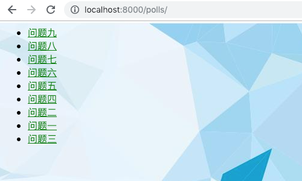

# 第43课：分页

### 简介
Django 提供了一些帮助你管理分页数据，这些类在 django/core/paginator.py 中定义

### 例子
```
>>> from django.core.paginator import Paginator
>>> objects = ['Pyton', 'Go', 'C', 'C++', 'C#']
>>> p = Paginator(objects, 2)
>>> p.count
5
>>> p.num_pages
3
>>> p.page_range
range(1, 4)
>>> page1 = p.page(1)
>>> page1
<Page 1 of 3>
>>> page1.object_list
['Pyton', 'Go']
>>> page2 = p.page(2)
>>> page2.object_list
['C', 'C++']
>>> page2.has_next()
True
```

### 在视图中使用Paginator
先通过Admin后台增加一些问题，



### 修改视图
polls/views.py
```
from django.core.paginator import Paginator

```

### 修改模版
polls/index.html
```
```

配图来自Twitter：@ukiukisoda


