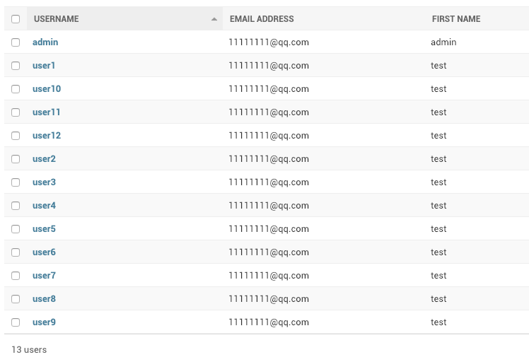
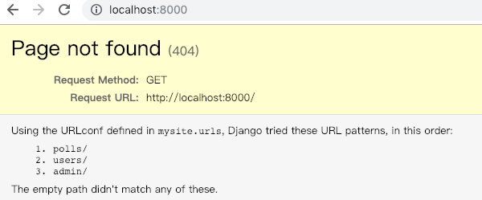
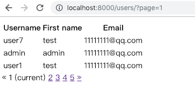

# 第43课：分页

### 简介
Django 提供了一些帮助你管理分页数据，这些类在 django/core/paginator.py 中定义

### 例子
```
>>> from django.core.paginator import Paginator
>>> objects = ['Pyton', 'Go', 'C', 'C++', 'C#']
>>> p = Paginator(objects, 2)
>>> p.count
5
>>> p.num_pages
3
>>> p.page_range
range(1, 4)
>>> page1 = p.page(1)
>>> page1
<Page 1 of 3>
>>> page1.object_list
['Pyton', 'Go']
>>> page2 = p.page(2)
>>> page2.object_list
['C', 'C++']
>>> page2.has_next()
True
```

### 在视图中使用Paginator
为方便，直接使用 Django 自带的 User 模型（不需要自己创建，也没有迁移过程），先通过 Admin 后台增加一些测试用户。



创建一个 Users 应用：$ python manage.py startapp users

### 修改视图
users/views.py
```
from django.shortcuts import render
from django.contrib.auth.models import User
from django.core.paginator import Paginator, EmptyPage, PageNotAnInteger

def index(request):
    user_list = User.objects.all()
    page = request.GET.get('page', 1)

    paginator = Paginator(user_list, 3)
    try:
        users = paginator.page(page)
    except PageNotAnInteger:
        users = paginator.page(1)
    except EmptyPage:
        users = paginator.page(paginator.num_pages)

    return render(request, 'user_list.html', { 'users': users })

```

### 修改模版
users/templates/user_list.html
```
<table class="table table-bordered">
  <thead>
    <tr>
      <th>Username</th>
      <th>First name</th>
      <th>Email</th>
    </tr>
  </thead>
  <tbody>
    
      <tr>
        <td>{{ user.username }}</td>
        <td>{{ user.first_name }}</td>
        <td>{{ user.email }}</td>
      </tr>
    
  </tbody>
</table>


  <class="pagination">
    
        <a href="?page={{ users.previous_page_number }}">&laquo;</a></li>
    
        <class="disabled"><span>&laquo;</span>
    
    
        
            <class="active"><span>{{ i }} <span class="sr-only">(current)</span></span>
        
            <a href="?page={{ i }}">{{ i }}</a>
        
    
    
        <a href="?page={{ users.next_page_number }}">&raquo;</a>
    
        <class="disabled"><span>&raquo;</span>
    

```

### URL声明
users/urls.py
```
from django.urls import path
from . import views

app_name = 'users'
urlpatterns = [
    path('', views.index, name='index'),
]

```

### mysite添加相应配置
把 users 应用添加到 mysite 项目里（一个项目可包含多个应用）：

mysite/settings.py
```
INSTALLED_APPS = [
    'users.apps.UsersConfig',
    'polls.apps.PollsConfig', 
```

mysite/urls.py
```
urlpatterns = [
    path('users/', include('users.urls')),
    path('polls/', include('polls.urls')),      
```

### 大功告成
$ python manage.py runserver

http://localhost:8000/ 可看到有 users 应用了



http://localhost:8000/users



配图来自Twitter：@ukiukisoda


